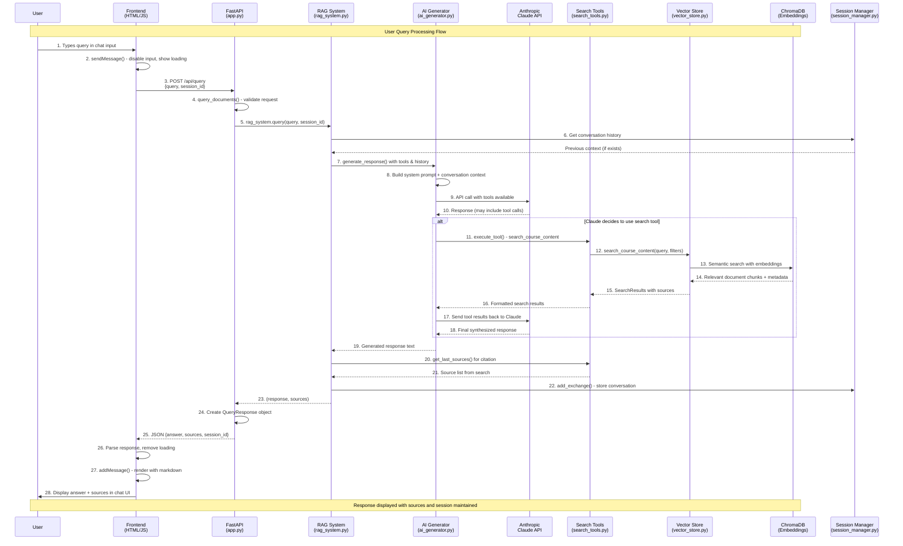

# RAG System Query Flow Diagram

## Component Responsibilities

### Frontend Layer
- **HTML/CSS**: Chat interface, input fields, loading states
- **JavaScript**: Event handling, API calls, UI updates, markdown rendering

### API Layer  
- **FastAPI**: HTTP endpoints, request validation, response formatting
- **CORS**: Cross-origin support, static file serving

### RAG Orchestration
- **RAG System**: Main coordinator, session management integration
- **Session Manager**: Conversation history, context preservation

### AI Processing
- **AI Generator**: Claude API integration, tool orchestration
- **Search Tools**: Semantic search interface, result formatting

### Data Layer
- **Vector Store**: ChromaDB interface, embedding management
- **Document Processor**: Text chunking, metadata extraction (used during indexing)

## Key Data Transformations

1. **User Input** → POST JSON
2. **Query** → System Prompt + Context  
3. **Prompt** → Claude Tool Calls
4. **Tool Parameters** → Vector Search Query
5. **Document Chunks** → Tool Results
6. **Tool Results** → Claude Response
7. **Response** → JSON API Response
8. **JSON** → Rendered HTML/Markdown

## Session Flow
- Session created on first query if not provided
- Conversation history maintained throughout session
- Context passed to Claude for coherent multi-turn conversations
- Sources tracked and reset after each query